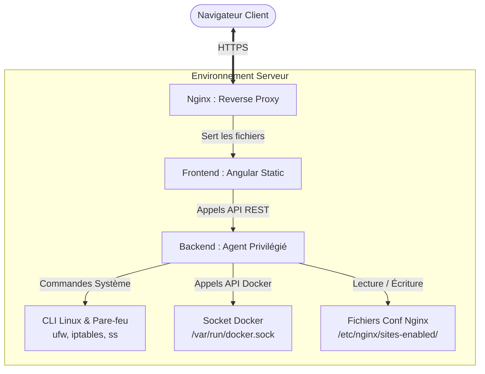

# DOCUMENT DE CONTEXTE TECHNIQUE ET SPÉCIFICATIONS (IA-READY)
## Projet : Panel de Gestion Serveur (Ports, Docker, Nginx)

> **Instructions pour l'IA :** Ce document sert de source unique de vérité (*Single Source of Truth*) pour l'application. Tu dois impérativement respecter l'architecture, la stack technique, les contraintes de sécurité et les règles de nommage définies ci-dessous lors de la génération de code, de scripts ou de configurations.

---

## 1. Informations Générales & Philosophie du Projet

### 1.1 Objectif
L'application est un panel d'administration web auto-hébergé permettant de piloter graphiquement un serveur Linux. Elle centralise la gestion des ports réseau, le cycle de vie des conteneurs et images Docker, ainsi que la configuration des blocs serveurs (Reverse Proxy) de Nginx.

### 1.2 Topologie de Déploiement
* **Hébergement :** L'application est installée directement sur la machine cible (le serveur Linux à manager).
* **Mode d'exécution préconisé :** L'application (Frontend + Backend Agent) tourne elle-même dans un conteneur Docker isolé ou sous forme de service système (`systemd`), ayant des accès restreints mais nécessaires aux composants de l'hôte (Socket Docker, dossiers de configuration Nginx).

---

## 2. Architecture Système

## 2. Architecture Système

L'application suit une architecture découplée classique de type Client-Serveur. Voici la topologie des flux de données et d'exécution :



### 2.1 Le Frontend (Angular)
Une application Single Page (SPA) développée en **Angular (v20+)**. Elle fournit l'interface utilisateur (UI/UX) pour visualiser l'état du serveur et envoyer des commandes à l'API.

### 2.2 Le Backend (Agent de Gestion)
*Puisqu'Angular s'exécute dans le navigateur, un agent backend intermédiaire en Rust est obligatoire pour interagir avec le système Linux.*
* **Rôle :** Exécuter les commandes système, requêter l'API Docker, et modifier les fichiers de configuration de manière sécurisée.
* **Communication :** API REST sécurisée par jetons (JWT) avec communication exclusive en HTTPS.

---

## 3. Pile Technique Spécifiée (Stack)

* **Frontend :** Angular 20+.
* **Backend (Recommandé pour l'IA) :** Rust (pour sa performance, sa sécurité mémoire et son écosystème de crates pour l'exécution de commandes système et la manipulation de fichiers).
* **Base de données (Optionnelle / Légère) :** Stockage fichier (JSON sécurisé) uniquement pour la gestion des utilisateurs du panel et des logs d'audit. L'état des conteneurs et des ports doit toujours être lu *en temps réel* depuis le système (pas de désynchronisation).
* **OS Cible :** Linux (Ubuntu Server / Debian de préférence).

---

## 4. Spécifications Fonctionnelles

L'application est divisée en 3 modules principaux + 1 module d'administration.

### 4.1 Module 1 : Gestion des Ports Réseau
* **Visualisation :** 
    * Lister tous les ports ouverts et en écoute sur la machine (`ss -tulpn` ou équivalent).
    * Identifier le processus ou conteneur qui utilise chaque port.
* **Configuration du Pare-feu (UFW / Iptables) :**
    * Ouvrir / Fermer un port (TCP/UDP).
    * Activer / Désactiver des règles de pare-feu à la volée.
    * Définir des restrictions par IP sources (Optionnel).

### 4.2 Module 2 : Gestion de l'Écosystème Docker
L'agent backend communique directement avec `/var/run/docker.sock` par défaut (possibilité de le chager).
* **Gestion des Conteneurs :**
    * Lister les conteneurs (Actifs, Arrêtés, Tous) avec stats en temps réel (CPU, RAM, Réseau).
    * Actions de cycle de vie : Démarrer, Arrêter, Redémarrer, Supprimer, Forcer l'arrêt.
    * Visualisation des Logs en temps réel (Streaming via WebSockets ou Server-Sent Events).
* **Gestion des Images :**
    * Lister les images locales, afficher leur taille et leur tag.
    * Supprimer les images inutilisées (*Prune*).
    * Lancer un *Pull* d'une nouvelle image depuis le Docker Hub ou un registre privé.

### 4.3 Module 3 : Gestion de Nginx (Reverse Proxy)
L'agent backend doit avoir les droits d'écriture sur `/etc/nginx/sites-available/` et `/etc/nginx/sites-enabled/`.
* **Visualisation :** Lister les hôtes virtuels (*Virtual Hosts*) actifs et inactifs.
* **Création / Édition de Configuration :**
    * Formulaire guidé pour générer un Reverse Proxy (Nom de domaine -> IP Interne / Port du conteneur Docker).
    * Éditeur de texte brut (avec coloration syntaxique) pour les configurations complexes.
* **Actions Système Nginx :**
    * Tester la configuration (`nginx -t`) avant d'appliquer.
    * Recharger Nginx (`systemctl reload nginx`) en cas de succès.
* **Sécurité SSL :** Intégration optionnelle avec Certbot pour générer et renouveler automatiquement des certificats Let's Encrypt (`certbot --nginx -d domaine.com`).

### 4.4 Module 4 : Sécurité & Administration du Panel
* **Authentification :** Écran de connexion obligatoire avec protection contre les attaques par force brute (ex: Fail2ban ou limitation de tentative en mémoire).
* **Logs d'Audit :** Journaliser chaque action critique (ex: "Utilisateur X a arrêté le conteneur Y", "Port 22 fermé").

---

## 5. Sécurité et Contraintes Systèmes Critiques

C'est le point le plus sensible de l'application. Donner des accès root à une application web représente un risque majeur.

1.  **Principe du Moindre Privilège :** L'agent Backend ne doit pas tourner directement en tant que `root`. Il doit utiliser des mécanismes ciblés (ex: `sudoers` restrictif pour la commande `nginx`, appartenance au groupe `docker` pour le socket).
2.  **Validation des Entrées (Input Validation) :** Interdiction stricte de concaténer directement des chaînes de caractères saisies par l'utilisateur pour exécuter des commandes Bash (Risque d'injection de commandes). Utiliser des arguments séparés avec `child_process.execFile` ou `subprocess.run`.
3.  **Gestion du Socket Docker :** L'accès au socket Docker équivaut à un accès root sur la machine. L'API Backend doit valider minutieusement chaque paramètre avant de le passer à l'API Docker.
4.  **Isolement Réseau :** Le panel lui-même doit être accessible uniquement via HTTPS, idéalement protégé derrière une double authentification (2FA) ou accessible uniquement via un VPN (ex: Wireguard, Tailscale).

---

## 6. Modèles de Données Clés (Exemples de contrats d'API)

*Pour toute génération de code, utilise les structures JSON suivantes comme référence pour les échanges de données.*

### 6.1 Objet `Container`
```json
{
  "id": "a1b2c3d4e5f6",
  "name": "web-nginx-proxy",
  "image": "nginx:alpine",
  "status": "running",
  "state": "Up 3 hours",
  "ports": [
    { "privatePort": 80, "publicPort": 8080, "type": "tcp" }
  ],
  "cpuUsage": "1.2%",
  "memoryUsage": "45.2MB / 16GB"
}
```
### 6.2 Objet `NginxConfig`
```json
{
  "filename": "monapp.conf",
  "domain": "app.mon-domaine.fr",
  "targetProxy": "[http://127.0.0.1:8080](http://127.0.0.1:8080)",
  "sslEnabled": true,
  "isActive": true,
  "rawContent": "server {\\n    listen 80;\\n    server_name app.mon-domaine.fr;\\n...}"
}
```

### 6.3 Objet ``NetworkPort``
```json
{
  "port": 8080,
  "protocol": "tcp",
  "state": "LISTEN",
  "processName": "docker-proxy",
  "pid": 1245,
  "fwRuleAllowed": true
}
```
## 7. Directives pour l'IA lors du Développement

Lorsque l'utilisateur te demande de générer du code pour cette application, suis rigoureusement ces consignes :

Angular (Frontend) :

    Utilise l'architecture moderne d'Angular basée sur les Standalone Components.

    Implémente des Services dédiés pour chaque domaine (DockerService, NginxService, PortService).

    Gère proprement le cycle de vie des requêtes avec des Interceptors (notamment pour injecter le jeton JWT).

Backend :

    Ne génère jamais de code effectuant un exec("sudo " + userInput). Préfère l'utilisation de librairies officielles (comme la librairie officielle Dockerode pour Node.js ou docker-py pour Python).

    Toutes les routes modifiant l'état du système (POST, PUT, DELETE) doivent impérativement être protégées par le middleware d'authentification.

Gestion des Fichiers Nginx :

    Lors de la modification des configurations Nginx, écris d'abord dans un fichier temporaire, lance un test de configuration (nginx -t), et écrase le fichier de production uniquement si le test réussit.